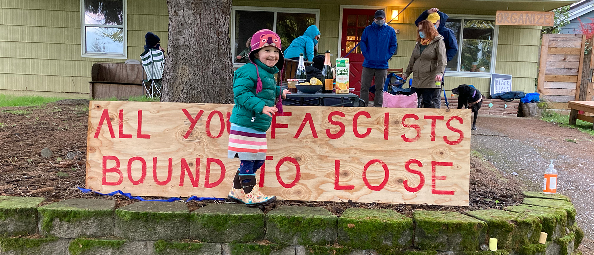

##Special Intro##

This month, for what seems like the first time in forever, there is a bit of hope that things can/will get better. There are still clearly dark times in the months ahead, but with the election (seemingly) wrapping up with the removal of Trump and promising news about a vaccine, it seems possible that by the middle of next year we might regain what we might consider life as we used to know it. So here's to that, hang on everybody.

#Time Fades Away#

I've been an avid podcast listener since 2006, when I started listening to Jimmy Pardo's *Never Not Funny* and Doug Benson's *I Love Movies* on a website called "Handheld Comedy" on my computer (since this was well before I had a handheld device that could play them). Over the last 15 years, podcasts have been a daily part of my life, and when I accept a show into my life, I tend to be a completist. Every show has its own collection of inside jokes and routines- getting familiar with the hosts and becoming a part of the world of the show provides a sense of comfort and community that can only come with spending multiple hours a week listening to someone talk.

But this year, I kind of just...stopped listening to some shows that had been a big part of my life for the last decade. I think a lot of it was about giving myself the freedom to do whatever felt right in the moment- if something felt like work, it got cut. And this freed me up to explore a bit, which led me to the show that I spent most of the year immersed in.

Enter: Blink 155.

The premise was simple- at the inception of the show, the band Blink-182 had released 155 songs. The goal was to create an episode about each of those songs, until the complete discography was covered. There are lots of shows with similar approaches to their subject matter- if you break down the thing you love into pieces small enough that you can't possibly just stick to the facts, you find the freedom to make connections to all kinds of other things that aren't obvious at a first pass. The episodes (which range from 1-4 hours in length) usually included a guest interview, a section of fan covers / recordings of teens in their garages, and a broad discussion about culture, music, and where those things intersect. And I *ate it up*.

Really, it was the single piece of entertainment I consumed the most this year. While working, while running, while driving, killing time. There was a 3 year backlog of weekly episodes and I listened to the whole run staring this February to catch up in time to be current when it ended in November.

I can't explain exactly why it worked so well for me, but I feel like one of the big things that drew me to the show was that I realized had some sort of repressed unfinished business with the band.

Blink-182 was my gateway into genres of music that changed my life forever. They were my first *real* rock and roll concert. They were the reason I learned to play guitar, and by extension the reason I was ever in a basement band with my friends. But over the span of a year or so in early high school, they went from being my favorite band on Earth to being something that I was borderline embarrassed by. And while I had plenty of new music I was head over heels for, there was a purity / simplicity to life that I was giving up as that shame complicated aspects of my musical opinions in ways that I'm still not sure I've totally come to terms with.

The show touches on this a lot- I think that a lot of us who got into more underground music subcultures after a deep love of this divisive pop-punk band were somewhat poisoned with a concern over what was "cool". It's something I still let annoy me about others but undeniably also still perpetrate on others in my own ways. One of the more inspiring takeaways from the show was an awareness that the "youth" of today don't seem to have quite the same cultural cynicism that came out of being a music fan in the late 90s. There seems to be a much more healthy approach to things now that everyone has access to everything, as the gates (and gatekeepers) have been removed.

And with the more recent albums (that I hadn't even heard until the show started), you also get to explore what it means to age and think about the awkward process of trying to grow while retaining the thing that everyone liked about you. The band didn't do this gracefully, and it was fascinating to think about the curse of being defined as something that primarily attracts teenagers and what sort of respect we need to retain for our past selves / what it means to stay what you are while you age.

The show doesn't treat the band with kid gloves- there are some legitimately awful components to both the music and the subculture attached to it. And I by no means mean to suggest that the band warrants exploration by those who have no current association with them or even much of a revisiting by those who had a phase.

I think that the biggest takeaway for me was learning to accept and include the band as part of my musical journey, appreciate what they did for me, and still with a critical eye be able to enjoy the things that I find truly enjoyable about their music. I do think they had a huge impact on a lot of people like me, who were the right age and in the right place in 1999/2000, looking for a way into something. And while listening, for brief moments, I got transported back to my parents house, in my bedroom with printed-out poorly-crafted guitar tablature, feeling like a rock star while fumbling through a very simple chord progression. And that was a gift this year.

##The Monthly Stuff##

Last month I did books, but this month I'm focusing on TV. I am pausing Dune: Messiah, but I did just finish Jesmyn Ward's *Salvage The Bones* and enjoyed it quite a bit. Will I read a book in December? Who knows!

####What I'm Watching####
TV has not generally not been one of my big time-killers in 2020. I'm able to zone out much easier by scrolling through Twitter, and I have a very low tolerance for bad TV, so I mostly have been avoiding it. However, I'm finding my way back in this month.

#####Fargo#####
Fargo has consistently been one of my favorite shows of the last decade. Seasons 1 and 2 in particular are among my favorite seasons of any show (I'm currently in the process of giving them a second watch, a rare thing for me and TV). This new season is fun, even if it's a little bit off at times. I'm going to blame the fact that it was under development when the pandemic hit, but "okay" Fargo is better than most other shows.

#####How To With John Wilson#####
As a huge *Nathan For You* fan, Nathan Fielder's production credit was an instant recommendation for this show, and boy, is it something to behold. There are only 6 episodes, each half an hour long, each loosely using documentary footage and narration to explain a basic task but usually getting a little lost along the way. It's like if you combined the awkward  exploration of the human condition of *Nathan For You* with the loose structure of *Going Deep with David Rees*, but it's so idiosyncratic and entirely it's own animal that you have to see it to understand. Episodes 1, 4 and 6 in particular.

#####Lodge 49#####
This is one I've had on my "to watch" list for a long time that I've finally picked up now that the production has ceased. It explores the journey of a sort of burnout Lebowski-esque character (but a little less detached) who joins a fraternal order as a sort of a vision quest to get his life on track. It's a bit mystical, and generally kindhearted towards it's characters- I'm about halfway through the first season but excited for the journey ahead.

####This Month's Music####
I don't always want to make this only about the music that was released this month- sometimes I get into things that I want to talk about because I finally got into them.

#####Willie Nelson - Red Headed Stranger#####
2020, especially fall, has been about finally exploring that long list of stuff I knew I'd get into one day. Right now, I'm on a big Willie Nelson kick. I just spent an hour browsing used records online and picked up a Willie Christmas album and "Waylon and Willie", and I can't wait until they get here. But this stuff, this is the gold standard.

<iframe src="https://open.spotify.com/embed/album/5aEtg4dxdBk4pj6SJ3hNsM" width="600" height="380" frameborder="0" allowtransparency="true" allow="encrypted-media"></iframe>

#####Alabaster DePlume - To Cy & Lee: Instrumentals, Vol. 1#####
This one grabbed me pretty quickly- I've dabbled only slightly in Ethiopian jazz (note the aforementioned to-do list), but have always enjoyed more recent artists that are clearly influenced by it, and that's what this is on its face. It's a nice saxophone album, mostly pretty warm and welcoming, and when I get into Ethiopian jazz for real one day I'll probably disown it, but I own it for now.

<iframe src="https://open.spotify.com/embed/album/657wUSfWEs3WcOA0xhsAfI" width="600" height="380" frameborder="0" allowtransparency="true" allow="encrypted-media"></iframe>

#####Young Jesus - Welcome to Conceptual Beach#####
This album is the one this year that makes me the most bummed about tour cancellations. It's the quintessential "Matt goes to a show alone to hear a band play songs from their new album that he loves" album, and I think it probably would have been incredible. I listen to it a lot and it is very pleasing to me.

<iframe src="https://open.spotify.com/embed/album/76nK69DufkCMk1v8kkmSA5" width="400" height="380" frameborder="0" allowtransparency="true" allow="encrypted-media"></iframe>

#####10 Songs I Listened To A Lot This Month#####
<iframe src="https://open.spotify.com/embed/playlist/6kFzFz9HVlnL1SKQC279Qs" width="600" height="380" frameborder="0" allowtransparency="true" style="margin:auto;" allow="encrypted-media"></iframe>

####A Photo From This Month####

####Favorite Tweets of the Month####
<blockquote class="twitter-tweet">
[walks in on my cats transitioning from a hunter-gatherer mode of subsistence to basic agriculture] what the fuck is this?
&mdash; regular gem (@Choplogik) <a href="https://twitter.com/Choplogik/status/1332207276560506883?ref_src=twsrc%5Etfw">November 27, 2020</a></blockquote>
<blockquote class="twitter-tweet">
[inventing archery] I’d stab that guy if he wasn’t so far away
&mdash; Troutman™ (@robotrowboat) <a href="https://twitter.com/robotrowboat/status/1012654396684013568?ref_src=twsrc%5Etfw">June 29, 2018</a></blockquote>
<blockquote class="twitter-tweet">
The three stooges of grief are: denial, anger, getting poked in both eyes at the same time
&mdash; Nick Nemeroff (@nicknemeroff) <a href="https://twitter.com/nicknemeroff/status/1328886370203529216?ref_src=twsrc%5Etfw">November 18, 2020</a></blockquote>

###Adios###

Well, that's it for now. Next month I'll probably do some broader list making and recapping on the year as a whole, so I guess it's time to start ruminating.

####Ok, See ya in a month.####
