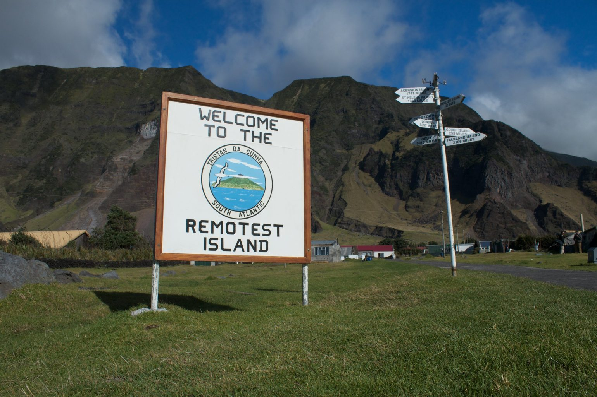

#Everybody Knows This is Nowhere#
I love to read Wikipedia pages about moderately sized communities that live in states of isolation. I think about Perth a lot for some reason. I’ve never been to Australia and don’t really know anything about it, but the physical location of Perth is fascinating to me. It’s in the middle of nowhere, across a barren continent on one side from all other significant population centers and across vast seas from everywhere else, but it has hospitals, universities, all of the things that make a modern city.

I also end up looking at tourist / scientist communities on Greenland on Google Maps street view from time to time, or fantasizing about Longyearben Norway, on Svalbard, where it’s against the law to leave your house without a polar bear rifle. But people live there! Thousands of people.

I daydream about going to the Antarctica depicted in [Encounters at the End of the World](https://en.wikipedia.org/wiki/Encounters_at_the_End_of_the_World) and never going outside. I guess it's probably like being on a cruise ship...the idea of the amenities and safety of being at home while still being somewhere kind of extreme.

It reminds me of the Mitch Hedberg joke about wanting to go to Everest and hang out at basecamp.
>I wanna mountain climb just to hang out at basecamp. You grow a beard, you drink hot chocolate. "Hey, you goin' to the top?".. "Soon..."

When Emily and I finished college, we traveled around Western Europe for a couple of months. To start and finish the trip, we were connected to a friend of a family friend in London who graciously put us up for a few nights and showed us the city. Nearly 15 years gone by now, I’d tried a few times recently to track him down online, despite not knowing his last name or really anything about him because that’s another thing I do for fun. This month, through a mostly unremarkable turn of events, I found him. I found him, and the architecture firm he is a partner in, and as confirmation there was a photo of him in an article about a design competition project somehow relating to the island of Tristan de Cunha, which I had never heard of.

It turns out that the island is part of the most remote archipelago in the world! There is no landing strip for airplanes- fishing boats from South Africa make it there less than 10 times a year. 250 people live there.

I don't know why I like these places. I think part of it is that they trigger a type of nostalgia I have for my childhood. Nostalgia is a big thing for me lately, it will probably be recurring topic of future discussion here.

I grew up in a "city" of 10,000- which was a lot of people. We had multiple grocery stores, like 70% of the big fast food chains, etc (a *proper* city). You could drive an hour or so and get to another city about that size, but we weren't really in the shadow of a culture that told us we were missing out on something (especially pre-internet). Still, it was idyllic- it did feel in some ways that the problems of the greater world couldn't reach us.

I'm realizing now it isn't really fair to small towns that so many of us who grew up in them associate our pasts with simplicity. The move out/up often coincides with new levels of independence, responsibility, an increasing awareness of the lack of control that you, as an adult, have in the "real" world. But you can (and most do) have that experience anywhere on Earth, no matter the size.

So I'm not nostalgic for isolation, I'm nostalgic for the ignorance and comfort of youth. But I know I've done that part already, and it's not a place you can or should ever try to return. I have a four year old daughter who has on occasion said she wishes she that was still a baby, and I have to remind her that if she was a baby, she wouldn't get to do all of the cool things she gets to do right now.

In a way, I guess what follows now is the stuff from this month that I'm glad I'm this age, in this place, able to have experienced.

##The Monthly Stuff##
*Note: One of the main reasons I started this thing up was that I felt like I came across a lot of great stuff this month. I don't want to overload this first one, so I'm gonna have to put some October stuff in November, or save it for a rainy day.*

####What I'm Reading####
I started it in September, but I primarily read (and finished) Frank Herbert's classic *Dune* this month. I started it because I had always meant to read it and wanted to make sure I finished it before the movie came out. Then the movie got delayed a year, and THEN I found out that the movie is only half of the book, which I kind of detest. I've watched half of the David Lynch one, and when I finish it will follow it up with [Jodorowsy's Dune](http://www.jodorowskysdune.com/).

The book was very much in my wheelhouse, and I got into it. I felt like I could see the templates/archetypes for the decades of science fiction / fantasy that followed taking shape. Obviously, as a once young man with visions of grandeur, the way the main character awakens and realizes his power is compelling but by this point in culture has become kind of cliche. Can't really blame ol' Frank for all that followed though.

I've got *Dune: Messiah* gathering a little dust on my nightstand for now, but I'll probably pick it back up in November. I do appreciate the turn that the story takes after Book 1 though, seemingly fulfilling the dark prophecy that looms over Paul as he becomes all-powerful.

####This Month's Music####
October is traditionally a huge release and tour month, and while clearly tours ain't happening, albums are being released like hotcakes. I took a few months off from caring about new music but this month has snapped me back in. Am I still nearly exclusively listening to Neil Young? Yes (more on that sometime later), but these are a few albums that came out this month that really tickled my fancy.

#####The Mountain Goats - Getting Into Knives#####
Hot damn, this was a pleasant surprise. I've been a fan of these guys for almost 20 years now, and as their sound has evolved and expanded, sometimes it's a real win for me and sometimes I'm just happy they're still out there. I felt like last year's *In League With Dragons* was a bit of a return to form after a couple of ones that didn't really grab me, and the surprise (cassette!) release this spring was fun but my only tape player is in my car and I ain't drivin much. When I saw they had ANOTHER album coming out this fall, I pre-ordered immediately because that's how I roll, but didn't really have expectations one way or another. But it rules! It feels spiritually similar to *Transcendental Youth*, which has become one of my favorites of theirs. High recommend if you've been into anything of theirs post-*Sunset Tree*.
<iframe src="https://open.spotify.com/embed/album/3hmzJ6czCNKNiSdRvFGToy" width="600" height="380" frameborder="0" allowtransparency="true" allow="encrypted-media"></iframe>

#####Mary Lattimore - Silver Ladders#####
There aren't very many harpists I can name, especially now that Joanna Newsom dropped off the scene, so Mary Lattimore is almost certainly the best one going right now. She has shown up on some solid releases over the last few years (2018's "Ghost Forests" was rad), and has a bit part in an album I nearly dedicated space to here (*North Americans - Roped In*, I'm listening to it while I write this post, check it out), but this new one is my favorite thing she's done. It's a little somber and moody at times, but never too unsettling- simultaneously the type of thing you can intently listen to or just put on repeat and get some work done.
<iframe src="https://open.spotify.com/embed/album/5ROFj16TsmnCUd5YtiVDU3" width="600" height="380" frameborder="0" allowtransparency="true" allow="encrypted-media"></iframe>

#####Cut Worms - Nobody Lives Here Anymore#####
I don't need to repeat conversations that you can find anywhere this album is discussed, but I do think that the extent to which this album gets described as sounding like it's from the 60's does it a bit of a disservice. The touchstones (touch tones? touchtones?) are obvious, but this is a truly incredible (double!) album of warm, hook-filled pop that feels genuine and genius and you could do a lot worse than putting in on on a Sunday morning with a cup of coffee.
<iframe src="https://open.spotify.com/embed/album/1GvCetmOWQbkkmG6fpXWgu" width="600" height="380" frameborder="0" allowtransparency="true" allow="encrypted-media"></iframe>

#####10 Songs I Enjoyed This Month#####
<iframe src="https://open.spotify.com/embed/playlist/6kFzFz9HVlnL1SKQC279Qs" width="600" height="380" frameborder="0" allowtransparency="true" style="margin:auto;" allow="encrypted-media"></iframe>

####A Photo From This Month####

####Favorite Tweets of the Month####
<blockquote class="twitter-tweet">
British-Dutch company Unilever has begun work on a vaccine for the mysterious illness caused by the Johnson &amp; Johnson vaccine
&mdash; josh &#39;Boogeyman&#39; (fiendlord99) (@oldfriend99) <a target="_blank" href="https://twitter.com/oldfriend99/status/1315880227839635456?ref_src=twsrc%5Etfw">October 13, 2020</a></blockquote>
<blockquote class="twitter-tweet">
I don’t care if he’s famous or not, what the Headless Horseman is doing is illegal
&mdash; Bridger Winegar (@bridger_w) <a target="_blank" href="https://twitter.com/bridger_w/status/1315130307285139458?ref_src=twsrc%5Etfw">October 11, 2020</a></blockquote>
<blockquote class="twitter-tweet">
I don’t wish for Donald Trump to die. Wishing was invented by the Walt Disney Corporation to sell rat merchandise. I just think it would be really funny
&mdash; Christin Bailey (@hexprax) <a target="_blank" href="https://twitter.com/hexprax/status/1312239239090692096?ref_src=twsrc%5Etfw">October 3, 2020</a></blockquote> 

###Adios###

Well, that's it for now. If you're also into any of these things or want to say hey, just reach out. We're in a weird cultural moment right now, and I think what I'm looking for is more meaningful interactions with fewer people. Will you be one of those people?

####Ok, See ya in a month.####
